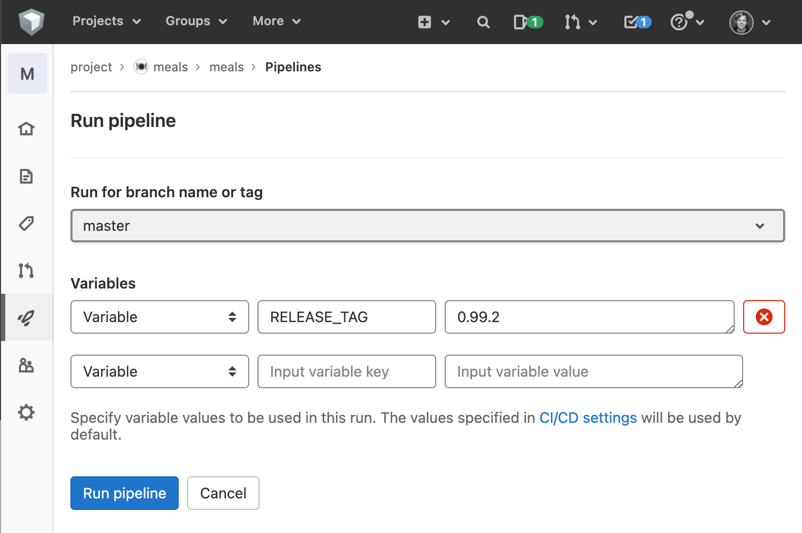

# Deployment of Meals on AOEs infrastructure

### Staging environment
Every commit in the master branch will trigger a build and deployment to the staging environment accessible to VPN connected employees via https://meals-staging.aoe.com/

### Release a new version on production
Execute the following steps to create a new release
- Create a new tag using semantic versioning: `git tag v1.0.1`
- Push tag to GitHub: `git push origin --tags`
- Wait for the created GitHub [actions pipeline](https://github.com/AOEpeople/meals/actions) to complete
- (optional) Ensure the newly created [tag on Docker Hub](https://hub.docker.com/r/aoepeople/meals/tags)
- If in doubt, test the new image locally by running
  ```bash
    export IMAGE_DEV=aoepeople/meals:1.0.1
    docker-compose pull dev
    docker-compose up -d dev
    open http://meals.test:8034
  ```
- Trigger the internal GitLab-CI Pipeline with a `RELEASE_TAG` variable via https://gitlab.aoe.com/project/meals/meals/-/pipelines/new
  
